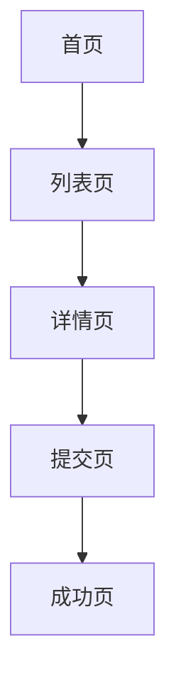

# Prototype Output Template

当本 skill 被触发时，默认按以下模板组织输出。若用户只要求其中一部分，可裁剪，但顺序应尽量保持一致。

如果用户没有指定技术栈，默认按 `HTML` 交互原型组织最终交付，同时保留 `Taro + React + TypeScript` 的实现导向建议。

默认把所有原型文件输出到项目根目录新建的 `prototype-output/` 目录。除非用户明确允许，否则不要新增或修改原项目现有业务目录中的文件。

## 1. 需求理解

```md
## 需求理解

- 产品类型：
- 核心用户：
- 核心目标：
- 核心功能：
- 主流程：
```

## 2. 假设

```md
## 假设

1. 假设 1
2. 假设 2
3. 假设 3
```

## 3. 页面清单

```md
## 页面清单

| 页面 | 页面目标 | 主要内容 | 主要操作 |
|---|---|---|---|
| 首页 |  |  |  |
| 列表页 |  |  |  |
| 详情页 |  |  |  |
```

## 4. 用户流程

优先使用 Mermaid：



## 5. 原型交互说明

```md
## 原型输出边界说明

- 原型文件统一输出到项目根目录：`prototype-output/`
- 不修改 `src/`、`pages/`、`components/`、`config/` 等原有业务目录
- 原型 HTML、CSS、JS、mock 数据全部放在独立原型目录内
```

## 6. 原型交互说明

```md
## 原型交互说明

- 点击线路卡片：进入详情页
- 点击 Tab：切换到目标页面
- 点击筛选项：打开底部弹层
- 点击确认：更新列表展示
- 点击提交：跳转成功页
```

## 7. 原型文件结构建议

默认优先给出 `HTML` 多页面结构：

```text
prototype-output/
  index.html
  pages/
    product.html
    detail.html
    form.html
    success.html
    mine.html
  assets/
    common.css
    pages.css
    app.js
    mock.js
```

## 8. 低保真原型图

每个核心页面至少给一个文本线框图：

```text
页面：首页

┌────────────────────┐
│ 顶部区域 / 标题栏    │
├────────────────────┤
│ 搜索 / 筛选区        │
├────────────────────┤
│ 核心内容卡片         │
│ ┌────────────────┐ │
│ │ 标题            │ │
│ │ 描述            │ │
│ │ [主按钮]        │ │
│ └────────────────┘ │
├────────────────────┤
│ Tab1 | Tab2 | 我的  │
└────────────────────┘
```

## 9. 页面详细说明

```md
## 页面：首页

### 页面目标

### 页面模块
1.
2.

### 字段说明

### 主操作

### 次操作

### 状态设计
- 加载态：
- 空状态：
- 错误态：
```

## 10. 组件拆分建议

```md
## 组件拆分建议

| 组件 | 用途 | 复用页面 |
|---|---|---|
| SearchBar | 顶部搜索入口 | 首页、列表页 |
| ContentCard | 列表卡片 | 首页、列表页 |
```

## 11. 页面目录与路由建议

默认优先给出 `Taro + React` 风格：

```md
## 页面目录与路由建议

pages/
- home/index.tsx
- home/index.config.ts
- home/index.scss
- order-list/index.tsx
- order-detail/index.tsx

components/
- SearchBar/index.tsx
- ContentCard/index.tsx

services/
- order.ts
- user.ts

store/
- user.ts
- order.ts
```

如用户指定 `uni-app`，则改为 `pages.json + pages/<page>.vue` 风格说明。

## 12. 状态、接口与复用边界建议

```md
## 状态、接口与复用边界建议

- 页面本地状态：筛选展开、表单输入、提交中状态
- 全局状态：登录态、用户信息、购物车/订单计数
- services：接口请求与 DTO 转换
- hooks / composables：列表请求、表单校验、倒计时逻辑
- 组件复用：搜索栏、筛选条、卡片、空状态、加载骨架
```

## 13. 数据结构建议

默认输出 TypeScript：

```ts
type ListItem = {
  id: string;
  title: string;
  description?: string;
  status?: string;
};
```

## 14. 开发 Agent Prompt

```md
## 开发 Agent Prompt

请根据上述页面原型、交互说明、组件拆分和数据结构建议，实现对应前端页面或 HTML 交互原型。
要求：
- 若未指定格式，优先输出 HTML 交互原型目录与文件
- 原型文件必须输出到项目根目录新建的 `prototype-output/`
- 不得新增或修改原项目已有业务目录中的文件
- 先输出目录结构
- 再输出页面文件与交互脚本
- 若我明确指定 Taro 或 uni-app，再切换到对应目录与页面组织
- 包含加载态、空状态、错误态
- 使用 mock 数据
- 预留接口类型和请求方法占位
```

## 额外要求

- 最终原型优先以 HTML 交付
- 需可点击、可跳转、可演示基础交互
- 原型文件与业务代码目录严格隔离
- 线框图以移动端竖屏为主
- 不要把“原型”写成高保真视觉稿文案
- 页面较多时，优先覆盖主流程页面
- 当需求不完整时，先列假设，再继续输出
- 实现导向部分要能映射到真实项目目录，避免空泛描述
